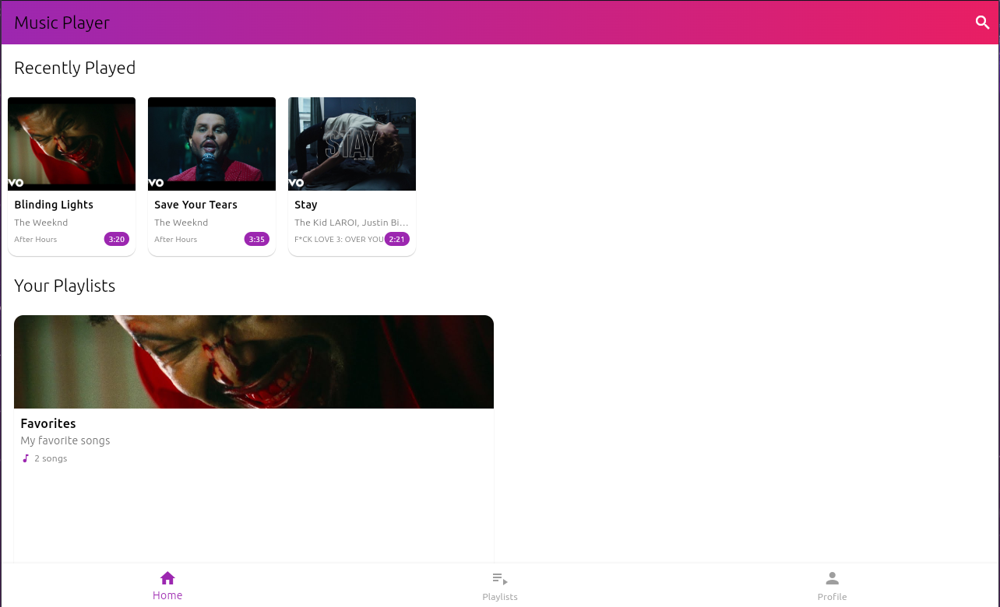
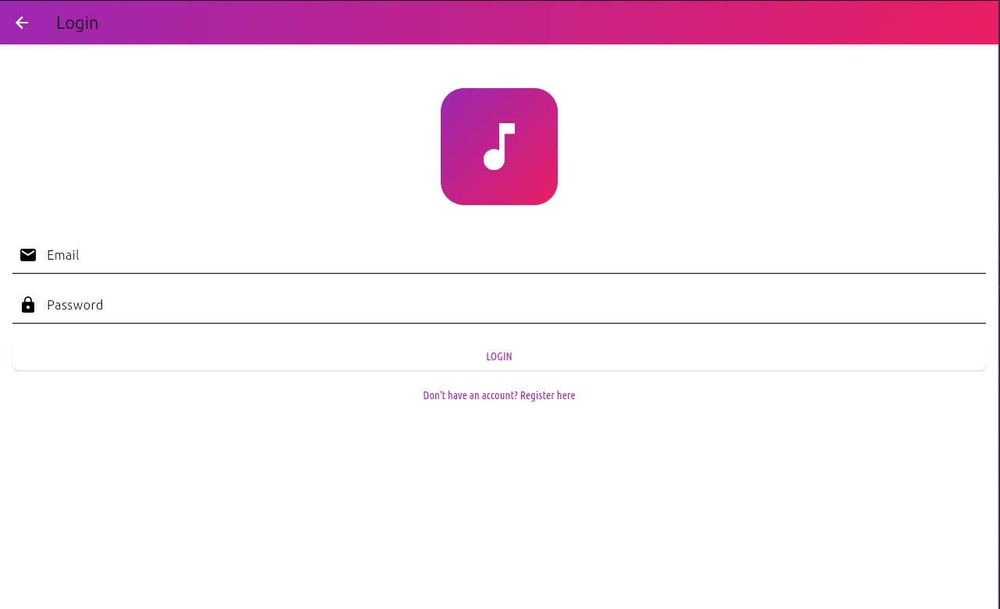

# 🎵 Flutter Music Player with XAMPP Backend


A beautiful cross-platform music player app built with Flutter, using XAMPP for backend API and database management.





## ✨ Features
- 🎶 Play local/streamed audio files
- 📱 Cross-platform (Android, iOS, Web)
- 🔍 Browse songs by artist/album
- 💾 XAMPP backend for:
  - User authentication
  - Playlist management
  - Song metadata storage
- 🎨 Sleek UI with dark/light themes

## 🛠️ Tech Stack
| Component       | Technology           |
|----------------|---------------------|
| Frontend       | Flutter (Dart)      |
| Backend        | XAMPP (Apache/PHP)  |
| Database       | MySQL               |
| API            | RESTful PHP API     |

## 🚀 Setup Guide

### Backend (XAMPP)
1. Install [XAMPP](https://www.apachefriends.org/download.html)
2. Clone this repo's `backend/` folder to `htdocs/`
3. Import `database/music_player.sql` to phpMyAdmin
4. Configure API endpoints in `lib/services/api_service.dart`

### Frontend (Flutter)
```bash
git clone https://github.com/your-username/flutter-music-player.git
cd flutter-music-player
flutter pub get
flutter run